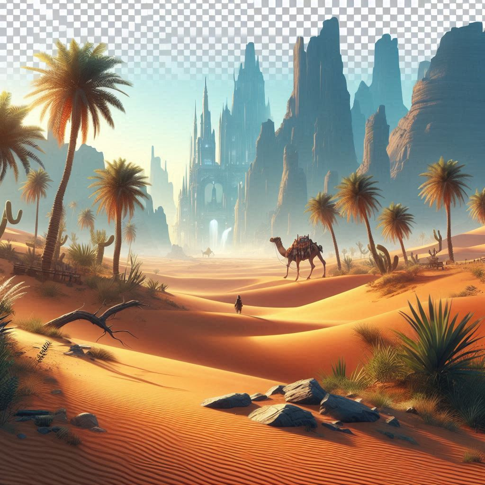

# KLAQ 95.5 FM - The Desert's Rock Station



A modern, responsive web application for KLAQ 95.5 FM radio station, featuring live streaming, concert listings, song requests, and interactive features for rock music enthusiasts.

## 🎸 Features

### 🔴 Live Radio Streaming
- **Real-time audio streaming** with HTML5 audio controls
- **Volume control** and playback management
- **Graceful fallback** to external player if direct streaming fails
- **Visual equalizer** animation during playback

### 📱 Responsive Design
- **Mobile-first approach** with responsive breakpoints
- **Touch-friendly navigation** with hamburger menu
- **Smooth scrolling** between sections
- **Optimized for all devices** (mobile, tablet, desktop)

### 🎵 Interactive Features
- **Song Request System** - Submit requests directly through the website
- **Concert Listings** - Upcoming rock concerts with ticket links
- **Prize Showcase** - Current giveaways and contests
- **Active Section Highlighting** - Navigation updates based on scroll position

### 🎨 Modern UI/UX
- **Dark theme** with rock-inspired color scheme
- **Smooth animations** and fade-in effects
- **Loading states** with animated spinners
- **Accessible design** with proper ARIA labels

## 🛠️ Technology Stack

- **React 19** - Latest React with concurrent features
- **Vite** - Fast build tool and development server
- **JavaScript ES6+** - Modern JavaScript features
- **CSS3** - Custom animations and responsive design
- **HTML5 Audio API** - For live streaming functionality

## 🚀 Getting Started

### Prerequisites

Make sure you have the following installed:
- **Node.js** (v14.0.0 or higher) - [Download here](https://nodejs.org/)
- **npm** or **yarn** package manager

### Installation

1. **Clone the repository**
   ```bash
   git clone <repository-url>
   cd KLAQ/rock
   ```

2. **Install dependencies**
   ```bash
   npm install
   # or
   yarn install
   ```

3. **Start the development server**
   ```bash
   npm run dev
   # or
   yarn dev
   ```

4. **Open your browser**
   ```
   http://localhost:5173
   ```

### Building for Production

```bash
npm run build
# or
yarn build
```

The built files will be in the `dist/` directory, ready for deployment.

### Preview Production Build

```bash
npm run preview
# or
yarn preview
```

## 📁 Project Structure

```
rock/
├── public/                 # Static assets
│   ├── acdc.jpg           # Concert images
│   ├── cactus.jpg         # Desert theme image
│   ├── crowd.jpg          # Prize images
│   ├── foofighters.jpg    # Band promotional images
│   ├── meet.jpg           # Meet & greet images
│   ├── merch.jpg          # Merchandise images
│   └── metallica.jpg      # Concert promotional images
├── src/
│   ├── components/        # React components
│   │   ├── Navbar.jsx     # Navigation with scroll detection
│   │   ├── Home.jsx       # Hero section with live streaming
│   │   ├── Features.jsx   # Station features showcase
│   │   ├── Prizes.jsx     # Prize listings
│   │   ├── Concerts.jsx   # Concert listings with loading states
│   │   ├── Requests.jsx   # Song request form
│   │   └── Footer.jsx     # Website footer
│   ├── App.jsx            # Main application component
│   ├── main.jsx           # Application entry point
│   ├── styles.css         # Global styles and animations
│   └── counter.js         # Utility (unused, from Vite template)
├── index.html             # HTML entry point
├── package.json           # Dependencies and scripts
├── vite.config.js         # Vite configuration
└── README.md              # This file
```

## 🎯 Component Overview

### `<Navbar />`
- **Responsive navigation** with mobile hamburger menu
- **Scroll-based styling** changes (transparency)
- **Active section highlighting** based on scroll position
- **Smooth scrolling** navigation to page sections

### `<Home />`
- **Live audio streaming** with error handling
- **Desert-themed branding** with cactus imagery
- **Play/pause controls** with volume adjustment
- **Fallback streaming** options

### `<Features />`
- **Grid layout** of station features
- **Icon-based design** with emojis
- **Fade-in animations** for visual appeal

### `<Concerts />`
- **Loading states** with animated spinner
- **Mock concert data** (ready for API integration)
- **Concert cards** with images, dates, and ticket links

### `<Requests />`
- **Song request form** with real-time updates
- **Local state management** for submitted requests
- **Dark theme styling** with inline styles

### `<Prizes />`
- **Prize showcase** with images and descriptions
- **Responsive image handling**
- **Contest information** display

## 🔧 Configuration

### Stream URL Configuration
The live stream URL is configured in `src/components/Home.jsx`:
```javascript
const streamUrl = "https://live.amperwave.net/direct/townsquare-klaqfmaac-ibc3";
```

### Vite Configuration
React and JSX support is configured in `vite.config.js`:
```javascript
export default defineConfig({
  plugins: [react({
    include: '**/*.{jsx,js}',
  })],
});
```

## 🎨 Styling

The application uses a single CSS file (`src/styles.css`) containing:
- **CSS Custom Properties** for consistent theming
- **Responsive media queries** for all screen sizes
- **CSS animations** for smooth interactions
- **Dark theme** color scheme

## 🚀 Deployment

### Netlify
1. Build the project: `npm run build`
2. Deploy the `dist/` folder to Netlify
3. Configure redirects for SPA routing

### Vercel
1. Connect your GitHub repository
2. Vercel will automatically detect Vite configuration
3. Deploy with zero configuration

### Traditional Hosting
1. Run `npm run build`
2. Upload contents of `dist/` to your web server
3. Configure server for SPA routing

## 🔮 Future Enhancements

### Backend Integration
- **Real-time concert data** from ticketing APIs
- **Song request management** system
- **User authentication** for personalized features
- **Analytics tracking** for listener engagement

### Enhanced Features
- **Social media integration** for sharing
- **Podcast section** with audio players
- **DJ schedule** and show information
- **Mobile app** development with React Native
- **Push notifications** for breaking news

### Technical Improvements
- **Progressive Web App** (PWA) features
- **Offline functionality** with service workers
- **Advanced audio controls** (equalizer, presets)
- **Real-time chat** during live shows

## 🤝 Contributing

1. **Fork the repository**
2. **Create a feature branch**: `git checkout -b feature/amazing-feature`
3. **Commit your changes**: `git commit -m 'Add some amazing feature'`
4. **Push to the branch**: `git push origin feature/amazing-feature`
5. **Open a Pull Request**

### Development Guidelines
- Follow **React best practices** and hooks patterns
- Use **semantic HTML** for accessibility
- Write **meaningful commit messages**
- Add **comments** for complex logic
- Test on **multiple devices** and browsers

## 🐛 Troubleshooting

### Audio Streaming Issues
- Check browser **autoplay policies**
- Verify **CORS settings** for stream URL
- Test with **different browsers**
- Check **network connectivity**

### Build Issues
- Clear **node_modules**: `rm -rf node_modules && npm install`
- Check **Node.js version** compatibility
- Verify **package.json** dependencies

### Performance Issues
- Use **React DevTools** for component analysis
- Check **image optimization** in public folder
- Monitor **network requests** in developer tools

## 📄 License

This project is licensed under the **MIT License** - see the [LICENSE](LICENSE) file for details.

## 🙏 Acknowledgements

- **KLAQ 95.5 FM** - The Desert's Rock Station
- **React Team** - For the amazing framework
- **Vite Team** - For the lightning-fast build tool
- **Rock music community** - For the inspiration
- **Open source contributors** - For making this possible

## 📞 Contact

For questions, suggestions, or support:

- **Website**: [KLAQ.com](https://klaq.com)
- **Email**: info@klaq.com
- **Phone**: 95.5 FM
- **Social Media**: Follow us for updates and rock news

---

**🎸 Keep Rocking with KLAQ 95.5 FM - The Desert's Rock Station! 🎸**
